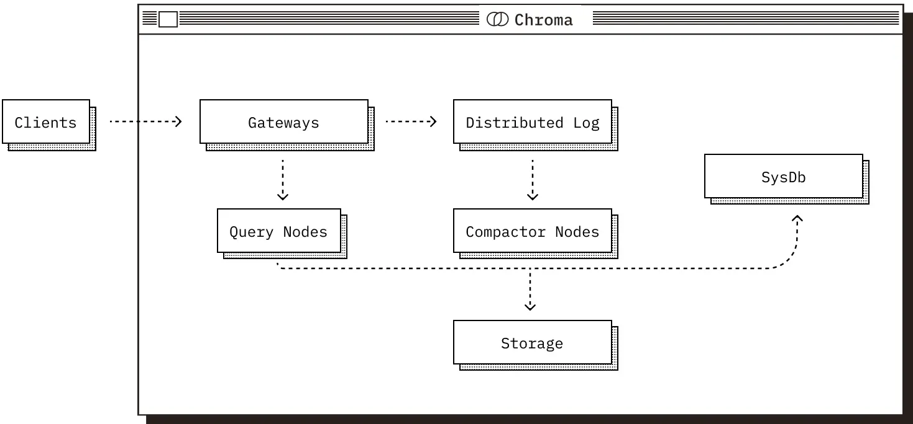

# Deployment Modes

Chroma runs wherever you need it to, supporting you in everything from local experimentation, to large scale production workloads.

- Local: as an embedded library - great for prototyping and experimentation.

- Single Node: as a single-node server - great for small to medium scale workloads of < 10M records in a handful of collections.

- Distributed: as a scalable distributed system - great for large scale production workloads, supporting millions of collections.

# Core componets



## The Gateway

The entrypoint for all client traffic.

- Exposes a consistent API across all modes.

- Handles authentication, rate-limiting, quota management, and request validation.

- Routes requests to downstream services.

## The Log

Chroma’s write-ahead log.

- All writes are recorded here before acknowledgment to clients.

- Ensures atomicity across multi-record writes.

- Provides durability and replay in distributed deployments.

## The Query Executor

Responsible for all read operations.

- Vector similarity, full-text and metadata search.

- Maintains a combination of in-memory and on-disk indexes, and coordinates with the Log to serve consistent results.

## The Compactor

A service that periodically builds and maintains indexes.

- Reads from the Log and builds updated vector / full-text / metadata indexes.

- Writes materialized index data to shared storage.

- Updates the System Database with metadata about new index versions.

## The System Database

Chroma’s internal catalog.

- Tracks tenants, collections, and their metadata.

- In distributed mode, also manages cluster state (e.g., query/compactor node membership).

- Backed by a SQL database.

## Storage & Runtime

These components operate differently depending on the deployment mode, particularly in how they use storage and the runtime they operate in.

- In Local and Single Node mode, all components share a process and use the local filesystem for durability.

- In Distributed mode, components are deployed as independent services.
    - The log and built indexes are stored in cloud object storage.
    - The system catalog is backed by a SQL database.
    - All services use local SSDs as caches to reduce object storage latency and cost.

# Chroma Data Model

- Collections

- Databases

- Tenants

## Collections

A collection is the fundamental unit of storage and querying in Chroma. Each collection contains a set of items, where each item consists of:

- An ID uniquely identifying the item

- An embedding vector

- Optional metadata (key-value pairs)

- A document that belongs to the provided embedding

Collections are independently indexed and are optimized for fast retrieval using vector similarity, full-text search, and metadata filtering. In distributed deployments, collections can be sharded or migrated across nodes as needed; the system transparently manages paging them in and out of memory based on access patterns.

## Databases

Collections are grouped into databases.

## Tenants

At the top level of the model is the tenant, which represents a single user, team, or account. Tenants provide complete isolation. No data or metadata, is shared across tenants. All access control, quota enforcement, and billing are scoped to the tenant level.


# Run

## EphemeralClient
```python
import chromadb

client = chromadb.EphemeralClient()
```

The `EphemeralClient()` method starts a Chroma server in-memory and also returns a client with which you can connect to it.

## Persistent Client

Data will be persisted automatically and loaded on start (if it exists).

```python
import chromadb

client = chromadb.PersistentClient(path="/path/to/save/to")
```

- `heartbeat()` - returns a nanosecond heartbeat. Useful for making sure the client remains connected.

- `reset()` - empties and completely resets the database. ⚠️ This is destructive and not reversible.

```python
client.heartbeat()

client.reset()
```

## Running Chroma in Client-Server Mode

### start Chroma server

```python
chroma run --path /db_path
```

Then use the Chroma HttpClient to connect to the server:
```python
import chromadb

chroma_client = chromadb.HttpClient(host='localhost', port=8000)
```
### async HTTP client

Chroma also provides the async HTTP client. 

The behaviors and method signatures are identical to the synchronous client, but all methods that would block are now async. To use it, call AsyncHttpClient instead:

```python
import asyncio
import chromadb

async def main():
    client = await chromadb.AsyncHttpClient()

    collection = await client.create_collection(name="my_collection")
    await collection.add(
        documents=["hello world"],
        ids=["id1"]
    )

asyncio.run(main())

```